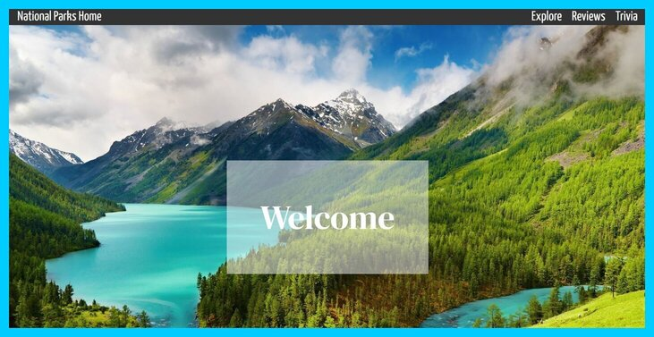
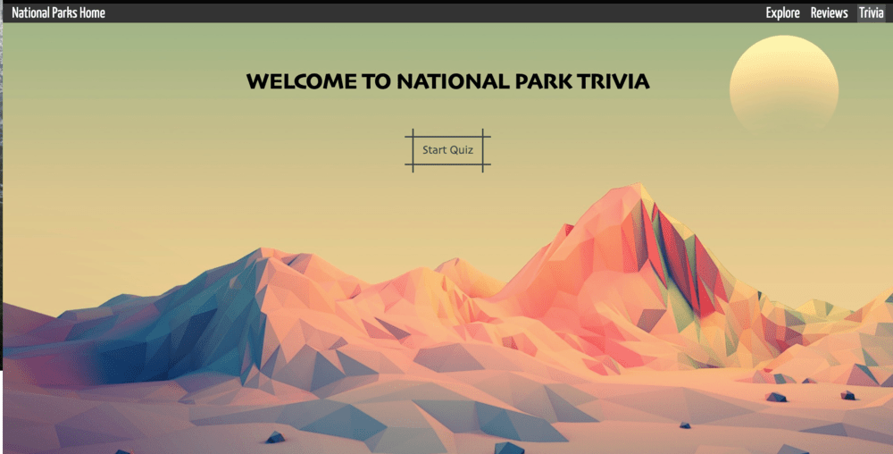
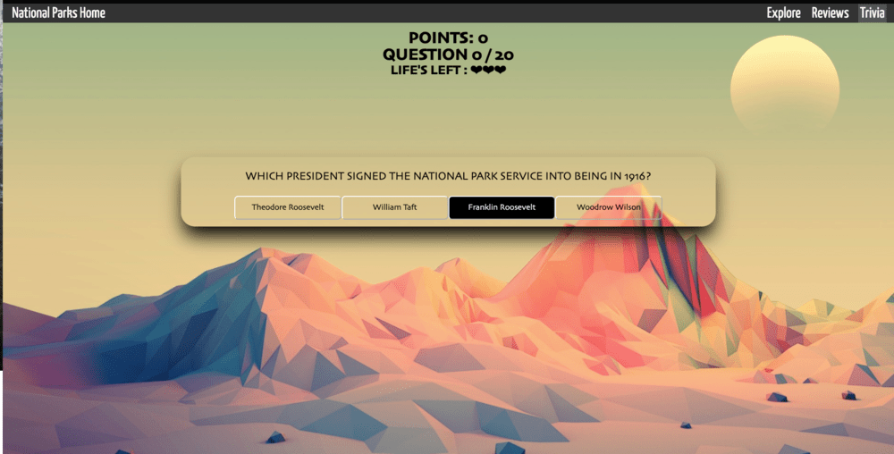
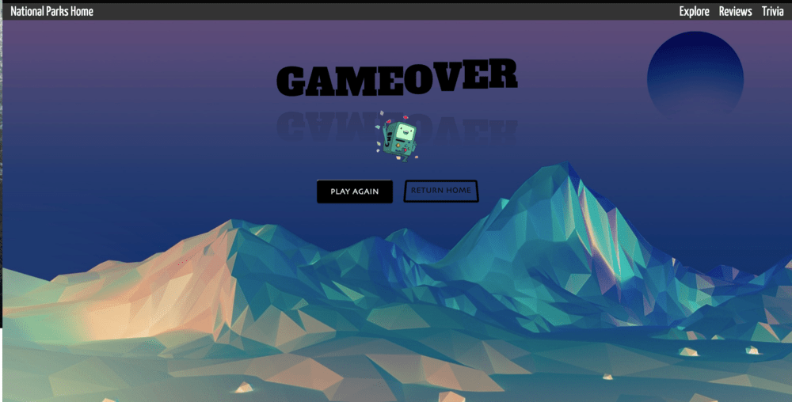

# National Parks Website 

Our National Park website is a single-page React application which allows users to learn about and discover new national parks, submit reviews about their visits and play fun park-related trivia.



# Installation & Usage

Begin by Cloning the repository into your local terminal
Navigate to the directory and run the following command:
```bash
code .
```
Run your mock server by typing the following into your terminal:
```bash
json server --watch src/parks.json
```
In a seperate terminal -- Install all necessary dependencies and Navigate to the web browser by running the following command:
```bash
npm i && start
```

# Website Features

Upon entering the web browser you are brought to the main page.
The Navigation bar at the top of the page can bring you to 4 destinations where you can do the following:

* <b>Home</b> - Book a Reservation at one of the 63 US National Parks.

* <b>Explore</b> - View all National Parks and learn more about each park's climate, location, and more features.


* <b>Reviews</b> - Read others reviews on their experience at a particular park. Create and leave your own Review!


* <b>Trivia</b> - Test your knowledge with our Nation Park Trivia Game!
 





## Further Reading
[View the project's blog post!](https://medium.com/@andrrowens/b248f5b0e20a)

## Creators:
* [Sarah Rodarte](https://github.com/srodarte1)
* [Genevieve Suder](https://github.com/genevievesuder)
* [Andrew Owens](https://github.com/andrrowens)
